---

title: WBC Classification
emoji: 🩸
colorFrom: red
colorTo: blue
sdk: docker
pinned: false
license: mit
app_port: 7860
--------------

# DM-FNet: White Blood Cell Classification

<p align="center">
  <strong>Deep Multi-scale Fusion Attention Network for five-class white blood cell classification</strong>
</p>

<p align="center">
  <a href="https://doi.org/10.1016/j.bspc.2026.109666">
    
  </a>
  <a href="https://huggingface.co/spaces/adffedccasfe/WBC">
    
  </a>
  
  
  
</p>

DM-FNet is a lightweight attention-based convolutional neural network developed for automated classification of microscopic white blood cell images. It combines a pretrained **MobileNetV2** backbone with three proposed components:

* **DKCAB** - Dilated Kernel Convolutional Attention Block
* **MSFFB** - Multi-scale Feature Fusion Block
* **CAB** - Context Attention Block

The model predicts five leukocyte categories: **Basophil, Eosinophil, Lymphocyte, Monocyte, and Neutrophil**. It was evaluated on the public **PBC** and **Raabin-WBC** datasets and is deployed as a Docker-based FastAPI application on Hugging Face Spaces.

> [!IMPORTANT]
> **Research-use disclaimer:** This application is a research and educational demonstration. It is **not a medical device** and has not been validated or approved for diagnosis, screening, triage, treatment, or patient-management decisions. Predictions must not replace review by a qualified hematologist, pathologist, or laboratory professional. Performance may change across microscopes, staining protocols, scanners, institutions, populations, and image-acquisition conditions.

---

## Live Application and Publication

* **Hugging Face Space:** https://huggingface.co/spaces/adffedccasfe/WBC
* **Published article:** https://doi.org/10.1016/j.bspc.2026.109666
* **Journal:** *Biomedical Signal Processing and Control*, Volume 118, Article 109666, 2026
* **Paper title:** *DM-FNet: Deep Multi-scale Fusion Attention Network for white blood cell classification*

### Authors

Amit Kumar, Sandesh Aryal, Sandeep Madarapu, Mohammad Iman Junaid, and Samit Ari.

---

## Supported White Blood Cell Classes

<p align="center">
  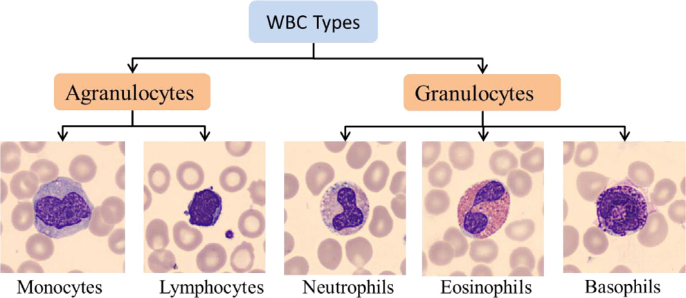
</p>

| Class          | General morphological cues used by the model                                   |
| -------------- | ------------------------------------------------------------------------------ |
| **Basophil**   | Dense, dark-purple cytoplasmic granules that may partially obscure the nucleus |
| **Eosinophil** | Bilobed nucleus and prominent eosinophilic granules                            |
| **Lymphocyte** | Large, round or slightly indented nucleus with a thin cytoplasmic rim          |
| **Monocyte**   | Large cell with kidney-shaped, horseshoe-shaped, or folded nucleus             |
| **Neutrophil** | Segmented or multilobed nucleus with fine cytoplasmic granules                 |

The model performs **image-level classification**. It does not count cells, segment complete blood smears, detect abnormalities beyond the trained five classes, or provide a clinical diagnosis.

---

## Published Highlights

| Item                                     |                     Published result / configuration |
| ---------------------------------------- | ---------------------------------------------------: |
| PBC evaluation subset                    |                              9,378 images, 5 classes |
| Raabin-WBC dataset                       |                             14,514 images, 5 classes |
| PBC accuracy                             |                                           **99.58%** |
| Raabin accuracy                          |                                           **98.54%** |
| Raabin weighted precision / recall / F1  |                         **98.57% / 98.55% / 98.55%** |
| Raabin Macro-F1 / MCC / QWK              |                               **0.96 / 0.97 / 0.97** |
| Model parameters                         |                                     **3.41 million** |
| Reported average inference time          |   **48.812 ms/image** on the paper's GPU workstation |
| Input size used by the deployed pipeline |                                **128 × 128 × 3 RGB** |
| Output                                   | Five-class softmax probabilities and predicted class |

> The reported numbers are results from the experimental datasets and setup described in the paper. They should not be interpreted as guaranteed performance on external clinical data.

---

# Model Architecture

## 1. Overall DM-FNet Pipeline

<p align="center">
  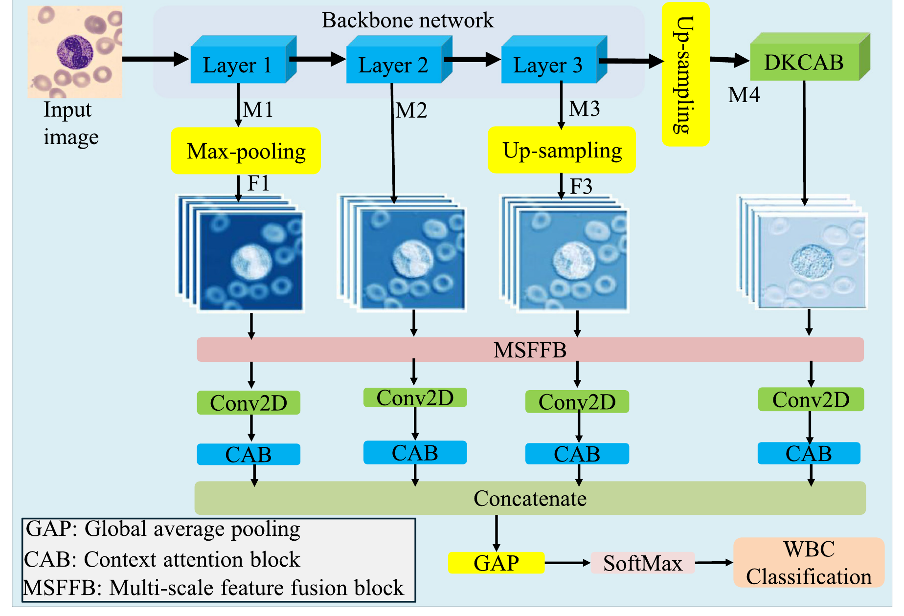
</p>

The processing pipeline is:

1. A microscopic RGB image is resized and normalized.
2. A pretrained **MobileNetV2** backbone extracts hierarchical feature maps from shallow, intermediate, and deep layers.
3. The feature maps are spatially aligned using max-pooling and up-sampling.
4. The deepest representation is refined by **DKCAB** to capture multi-scale morphology and adaptively weight complementary branches.
5. **MSFFB** fuses low-, mid-, high-level, and DKCAB-enhanced features.
6. Four fused branches are projected to 128 channels and independently refined using **CAB**.
7. The refined branches are concatenated, globally pooled, and passed through a dense classification head.
8. A five-unit softmax layer returns class probabilities.

### Backbone feature taps used in the implementation

```python
feature1 = base_model.get_layer("block_3_expand").output
feature2 = base_model.get_layer("block_6_expand").output
feature3 = base_model.get_layer("block_13_expand").output
```

The ImageNet-pretrained MobileNetV2 backbone is frozen in the provided training configuration, while the proposed fusion, attention, and classification layers are trained for WBC classification.

---

## 2. Dilated Kernel Convolutional Attention Block (DKCAB)

<p align="center">
  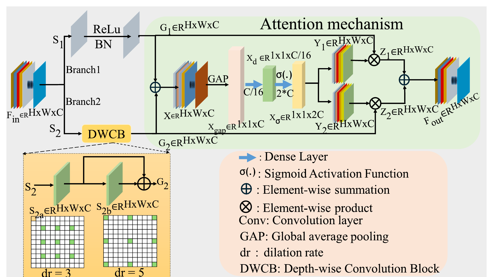
</p>

DKCAB processes the deepest backbone feature map using two complementary branches:

* **Local-detail branch:** two consecutive `3 × 3` convolutions preserve fine cellular structures.
* **Expanded-receptive-field branch:** stacked `5 × 5` dilated convolutions with dilation rates `3` and `5` capture wider morphological context without down-sampling.

The branch features are aggregated and summarized using global average pooling. Two dense layers generate branch-wise attention coefficients. These coefficients adaptively reweight the local and dilated representations before their final element-wise fusion.

Conceptually:

```text
Input feature
 ├─ Local branch: 3×3 Conv → BN → ReLU → 3×3 Conv → BN → ReLU
 └─ Dilated branch: 5×5 Conv (d=3) → BN → ReLU
                    → 5×5 Conv (d=5) → BN → ReLU + residual

Branch fusion → GAP → Dense(C/16) → Dense(2C, sigmoid)
             → split attention → weighted branch sum
```

**Purpose:** improve sensitivity to partially visible and overlapping leukocytes by combining fine detail with a broader receptive field.

---

## 3. Multi-scale Feature Fusion Block (MSFFB)

<p align="center">
  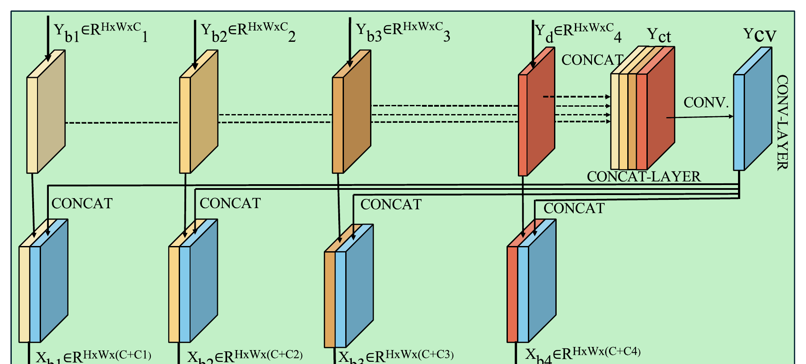
</p>

MSFFB receives four spatially aligned tensors:

* a shallow MobileNetV2 feature map,
* an intermediate feature map,
* a deep feature map,
* the DKCAB output.

All four tensors are concatenated and compressed with a `1 × 1` convolution. The compressed representation is then concatenated back with each original input branch, producing four enriched feature streams.

```text
Yct = Concat(Yb1, Yb2, Yb3, Yd)
Ycv = Conv1×1(Yct)

Xb1 = Concat(Yb1, Ycv)
Xb2 = Concat(Yb2, Ycv)
Xb3 = Concat(Yb3, Ycv)
Xb4 = Concat(Yd,  Ycv)
```

**Purpose:** preserve local cell details while sharing higher-level contextual information across all feature scales.

---

## 4. Context Attention Block (CAB)

<p align="center">
  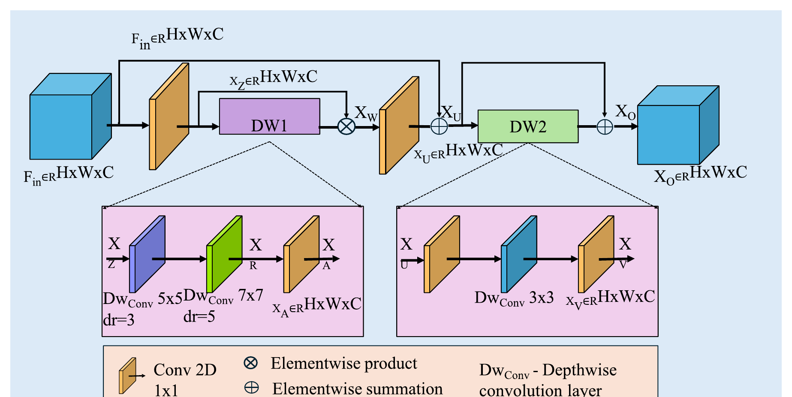
</p>

CAB refines each fused branch using point-wise, depthwise, dilated, and residual operations.

The first path applies:

```text
1×1 Conv + GELU
→ Depthwise 5×5 (d=3)
→ Depthwise 7×7 (d=5)
→ 1×1 Conv attention map
→ element-wise feature modulation
→ 1×1 Conv + GELU
→ residual addition
```

A second efficient refinement path applies:

```text
1×1 Conv → Depthwise 3×3 → 1×1 Conv → residual addition
```

**Purpose:** emphasize diagnostically relevant nuclear morphology and cytoplasmic texture while suppressing background red blood cells and less informative regions.

---

## 5. Classification Head

After the four CAB outputs are produced, the model uses:

```text
Concatenate four CAB outputs
→ GlobalAveragePooling2D
→ Dense(256, ReLU)
→ Dense(5, Softmax)
```

The final probability vector follows this class order in the deployed pipeline:

```python
[
    "Basophil",
    "Eosinophil",
    "Lymphocyte",
    "Monocyte",
    "Neutrophil",
]
```

---

# Training and Evaluation

## Training Configuration

| Hyperparameter       |                                          Value used in the published study |
| -------------------- | -------------------------------------------------------------------------: |
| Optimizer            |                                                                       Adam |
| Loss function        |                                                  Categorical cross-entropy |
| Maximum epochs       |                                                                         50 |
| Batch size           |                                                                         32 |
| Input                |                                                 RGB microscopic cell image |
| Normalization        |                                            Pixel values scaled to `[0, 1]` |
| Augmentation         |      Rotation, geometric transformations, and horizontal/vertical flipping |
| Imbalance handling   | Class-weighted categorical cross-entropy for the imbalanced Raabin dataset |
| Checkpoint criterion |                                                   Best validation accuracy |

## Training Curves

<table>
  <tr>
    <td align="center"><strong>Training and validation accuracy</strong></td>
    <td align="center"><strong>Training and validation loss</strong></td>
  </tr>
  <tr>
    <td>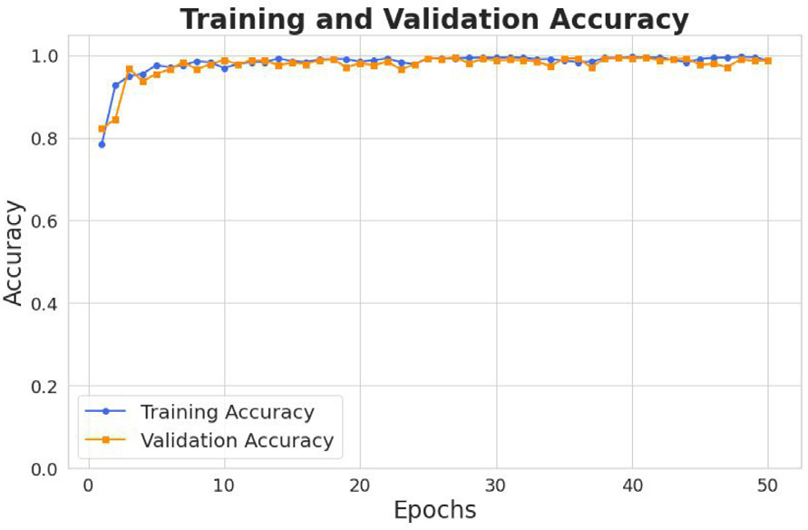</td>
    <td>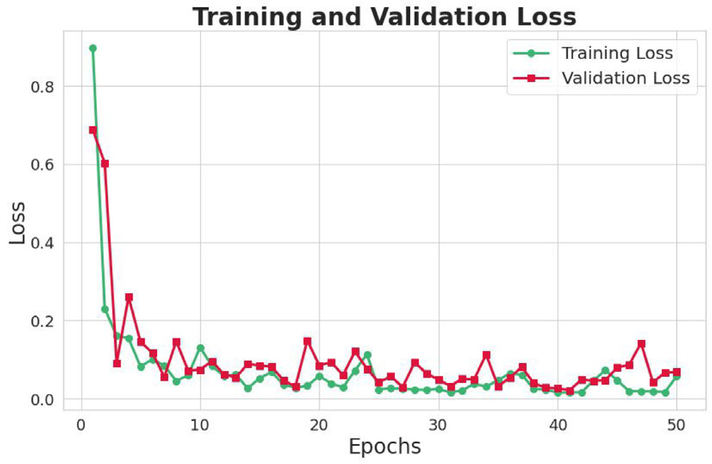</td>
  </tr>
</table>

The curves show rapid convergence and closely aligned training and validation behavior on the PBC experiment.

## Batch-size Study

<p align="center">
  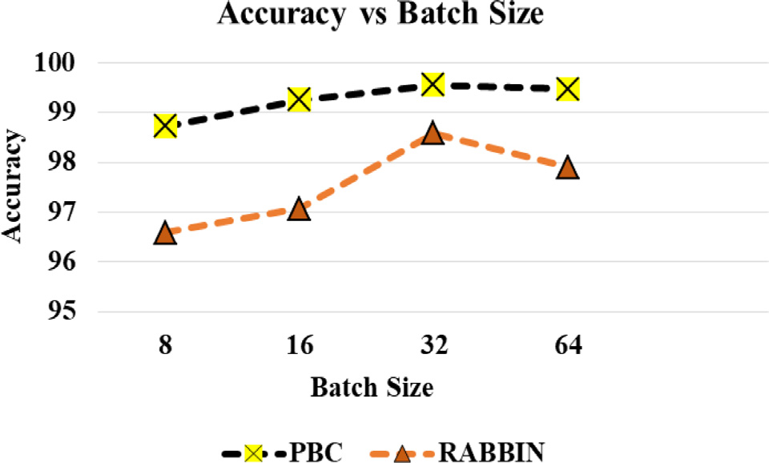
</p>

Among the tested values, a batch size of **32** produced the strongest accuracy trade-off on both datasets and was used in the final experiments.

---

# Quantitative Results

## Confusion Matrices

<table>
  <tr>
    <td align="center"><strong>PBC dataset</strong></td>
    <td align="center"><strong>Raabin-WBC dataset</strong></td>
  </tr>
  <tr>
    <td>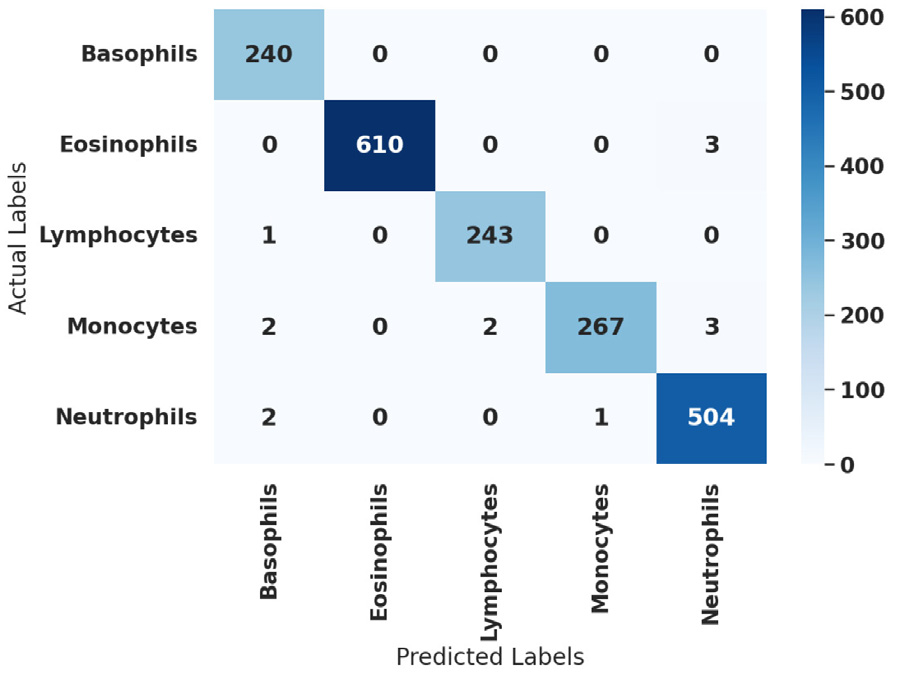</td>
    <td>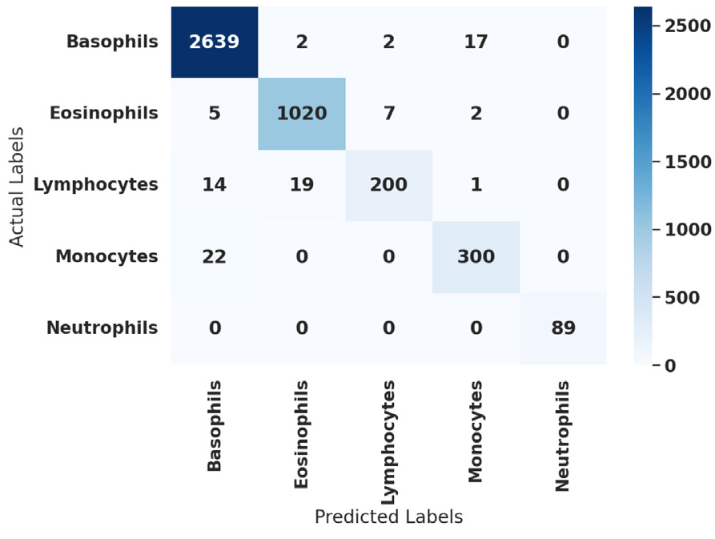</td>
  </tr>
</table>

The PBC matrix is nearly diagonal. The Raabin matrix shows that most remaining errors occur among morphologically similar non-neutrophil classes, while neutrophils are classified with very strong performance in the reported test set.

## ROC Curves

<p align="center">
  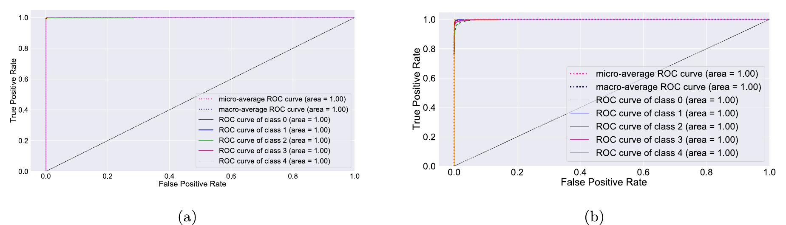
</p>

The paper reports micro-average and macro-average ROC-AUC values of approximately `1.00` for both evaluated datasets.

---

# Qualitative Explainability with Grad-CAM

<p align="center">
  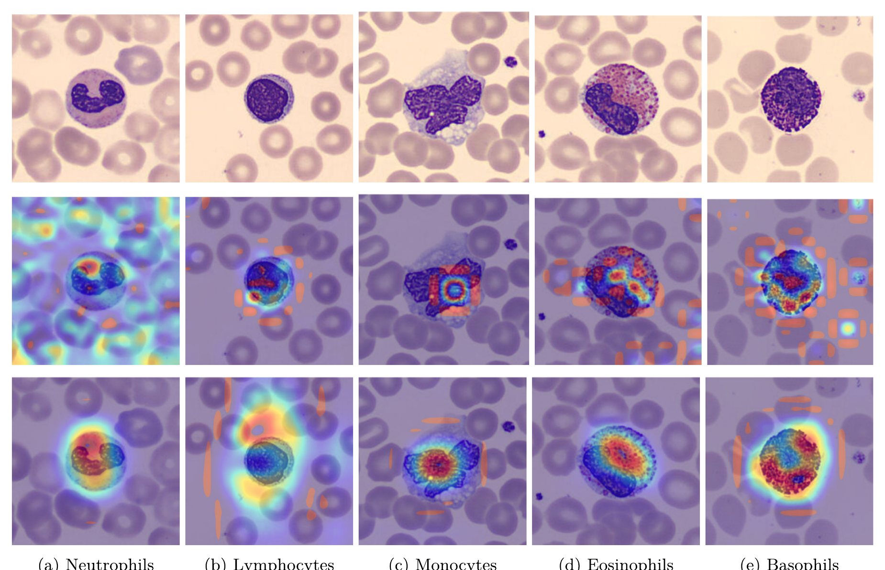
</p>

The visualization contains:

1. original PBC images in the first row,
2. intermediate DKCAB visualizations in the second row,
3. final Grad-CAM heat maps in the third row.

The activations indicate that the model frequently focuses on class-relevant structures such as nuclear lobes, dense granules, nucleus shape, and the nucleus-to-cytoplasm relationship. Grad-CAM is a qualitative inspection tool and should not be interpreted as proof of clinical causality or complete model reliability.

---

# Web Application

The deployment uses:

* **FastAPI** for REST endpoints and automatic API documentation,
* **TensorFlow/Keras** for model loading and inference,
* **OpenCV and Pillow** for image decoding and preprocessing,
* **Docker** for reproducible deployment,
* **Hugging Face Spaces** for hosting.

The current Hugging Face Space may enter a sleeping state after inactivity. Opening the Space restarts it, and the first request may take longer while the container and model are initialized.

## User Workflow

1. Open the Hugging Face Space.
2. Upload a microscopic WBC image.
3. The image is converted to RGB, resized to `128 × 128`, and normalized to `[0, 1]`.
4. DM-FNet predicts the five class probabilities.
5. The interface displays the predicted class, confidence score, and all class probabilities.

## Supported Upload Formats

* `.jpg`
* `.jpeg`
* `.png`
* `.bmp`
* `.tiff`
* `.gif`

Batch prediction accepts up to **10 images per request** in the current API implementation.

---

# API Endpoints

| Method | Endpoint             | Description                                            |
| ------ | -------------------- | ------------------------------------------------------ |
| `GET`  | `/`                  | Main web interface                                     |
| `GET`  | `/docs`              | Interactive Swagger API documentation                  |
| `GET`  | `/redoc`             | ReDoc API documentation                                |
| `GET`  | `/api/startup_check` | Check whether the service started and the model loaded |
| `GET`  | `/api/health`        | API and model health information                       |
| `POST` | `/api/predict`       | Classify one image                                     |
| `POST` | `/api/predict_batch` | Classify up to 10 images                               |
| `GET`  | `/api/model_info`    | Return loaded-model metadata                           |
| `GET`  | `/api/test`          | Basic service test                                     |

## Single-image Prediction

```bash
curl -X POST "http://localhost:7860/api/predict" \
  -H "accept: application/json" \
  -H "Content-Type: multipart/form-data" \
  -F "file=@sample_wbc.jpg"
```

Example response structure:

```json
{
  "success": true,
  "filename": "sample_wbc.jpg",
  "results": {
    "predicted_class": "Eosinophil",
    "confidence": 0.9981,
    "all_probabilities": {
      "Basophil": 0.0002,
      "Eosinophil": 0.9981,
      "Lymphocyte": 0.0004,
      "Monocyte": 0.0005,
      "Neutrophil": 0.0008
    }
  },
  "message": "Prediction completed successfully"
}
```

> The values above are only an example of the JSON structure; they are not a real patient result.

## Batch Prediction

```bash
curl -X POST "http://localhost:7860/api/predict_batch" \
  -H "accept: application/json" \
  -H "Content-Type: multipart/form-data" \
  -F "images=@cell_01.jpg" \
  -F "images=@cell_02.jpg"
```

---

# Run Locally with Docker

## 1. Clone the Hugging Face Space

```bash
git clone https://huggingface.co/spaces/adffedccasfe/WBC
cd WBC
```

## 2. Build the Docker Image

```bash
docker build -t dm-fnet-wbc .
```

## 3. Start the Application

```bash
docker run --rm -p 7860:7860 dm-fnet-wbc
```

Open:

```text
http://localhost:7860
```

API documentation:

```text
http://localhost:7860/docs
```

---

# Run Locally with Python

A clean Python environment is recommended.

```bash
python -m venv .venv
source .venv/bin/activate
pip install --upgrade pip
pip install -r requirements.txt
uvicorn app:app --host 0.0.0.0 --port 7860
```

On Windows PowerShell, activate the environment using:

```powershell
.venv\Scripts\Activate.ps1
```

---

# Project Structure

```text
WBC/
├── app.py                    # Exposes the FastAPI application
├── main.py                   # Routes, validation, web UI, and API endpoints
├── orchestration.py          # Model loading, preprocessing, and prediction pipeline
├── Dockerfile                # Hugging Face / Docker deployment configuration
├── requirements.txt          # Python dependencies
├── Models/                   # Trained Keras model files
├── static/                   # Frontend assets
├── assets/
│   └── readme/               # Paper figures used in this README
└── README.md
```

---

# Reproducibility Notes

* Use a fixed random seed for dataset splitting and framework operations.
* Fit the label encoder on the training labels and use the same fitted encoder for validation and test labels.
* Keep patient-, smear-, or acquisition-level leakage in mind when constructing dataset splits.
* For imbalanced data, report macro-F1, MCC, QWK, classwise sensitivity/recall, and confusion matrices in addition to accuracy.
* External validation should include images from unseen microscopes, laboratories, staining protocols, and acquisition devices.
* Confidence scores from a softmax classifier are not automatically calibrated probabilities; evaluate calibration before risk-sensitive use.

---

# Limitations

* The deployed classifier predicts only five normal WBC categories represented in the training label space.
* It does not detect leukemic blasts, immature cells, artifacts, red blood cells, platelets, parasites, or unknown/out-of-distribution samples.
* Dataset-level accuracy does not establish safety or clinical utility.
* Microscopy domain shift can arise from staining, illumination, optics, sensor properties, magnification, compression, and preprocessing.
* A high-confidence prediction can still be incorrect, especially for out-of-distribution images.
* Prospective, multi-center, clinically governed validation is required before any real-world diagnostic application.

---

# Citation

Please cite the published work when using the architecture, results, or implementation:

```bibtex
@article{kumar2026dmfnet,
  title   = {DM-FNet: Deep Multi-scale Fusion Attention Network for white blood cell classification},
  author  = {Kumar, Amit and Aryal, Sandesh and Madarapu, Sandeep and Junaid, Mohammad Iman and Ari, Samit},
  journal = {Biomedical Signal Processing and Control},
  volume  = {118},
  pages   = {109666},
  year    = {2026},
  doi     = {10.1016/j.bspc.2026.109666}
}
```

---

# License and Figure Notice

The source code is released under the **MIT License** unless otherwise stated.

The architecture diagrams, plots, confusion matrices, and Grad-CAM panels reproduced in this README originate from the published article and remain subject to the publisher's copyright and author-sharing terms. Confirm the applicable Elsevier sharing permissions before redistributing the figures outside this project repository.

---

## Acknowledgements

This research was conducted through collaboration involving the Department of Chemistry and the Department of Electronics and Communication Engineering at the National Institute of Technology Rourkela, along with the School of Computer Science and Artificial Intelligence at SR University.
